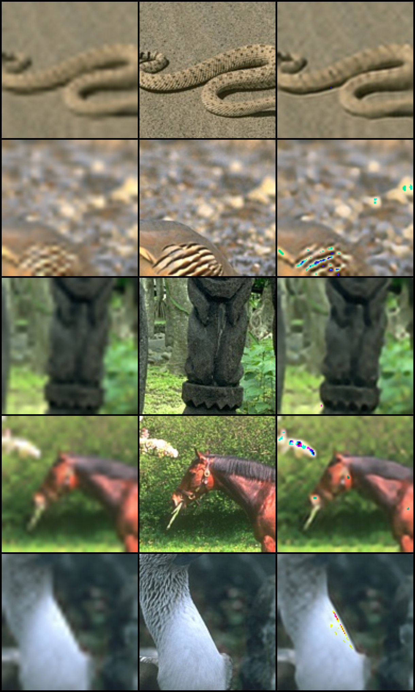
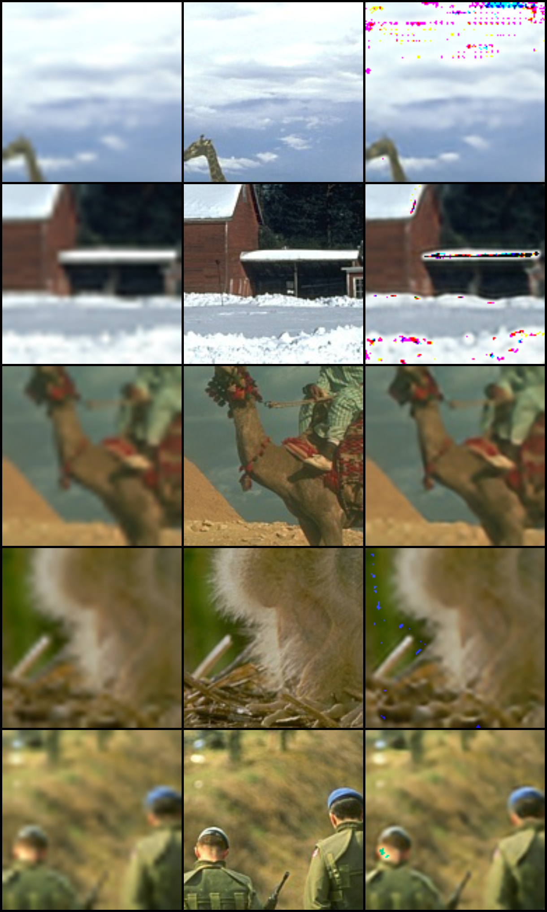
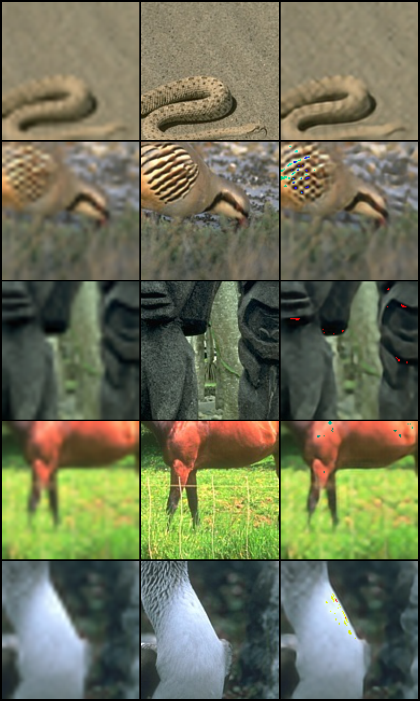
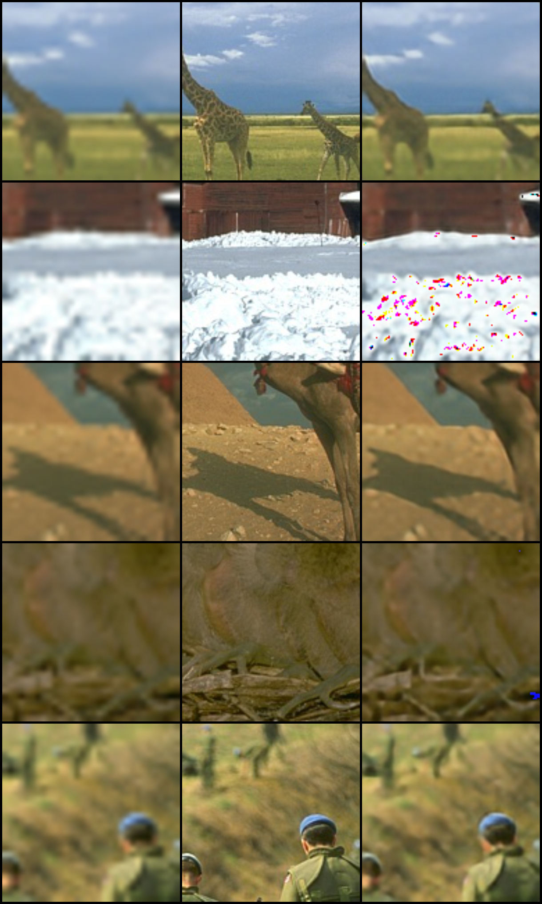

# EDSR - Pytorch 

同样是 `Super Resolution` 领域的一个经典文章，有了 `SRCNN` 的一个基础, 以及我们上次复现了 `VDSR` 还有 `SRGAN` 
这次的论文复现我们选择复现 `EDSR` 它和 `SRGAN` 有着类似的 `ResBlock` 结构，只不过不同的是通过研究发现 `BatchNormal` 
虽说对训练有着非常高的速度上面的提高，但是对结果的影响甚微，所以 `EDSR` 的 `ResBlock` 相对于 `SRGAN` 来说有着小小的区别。 
这一次我们直接把它搭建成我们比较常用的 `torch` 的方式。  
  这一次的 `torch` 复现利用以前的复现内容一下子就搭建起来了，后续也会慢慢的优化和review原来的代码。

## 以下是对应的之前 Super Resolution 的论文重点：

#### SRGAN 论文重点
在实现 `SRGAN` 论文之前我们实现了我们的传统的 `VDSR` 以及更加前面我们实现过的 `SRCNN` 这两个都是比较入门的 `Super Resolution` 方向的论文。    
`GAN` 神经网络是一个非常特别的神经网络，训练会极其复杂。总体来说 `SRGAN` 的 `generator` 使用的是 `VGG19`。

#### VDSR
`VDSR`  [Accurate Image Super-Resolution Using Very Deep Convolutional Networks](https://www.cv-foundation.org/openaccess/content_cvpr_2016/papers/Kim_Accurate_Image_Super-Resolution_CVPR_2016_paper.pdf)  
以及 `VDSR` 论文的重点为：
* 模型具有非常深的层
* 使用了残差学习和自适应梯度裁剪来加速模型的训练
* 将单一倍数的超分模型扩充到多个倍数  
  
与`SRCNN`一样，都是先将低分辨率输入双三次插值到高分辨率，再来进行模型的预测。
这里包括两个部分，VGG-like的深层网络模型，每一层卷积中均使用带padding的3x3卷积层，
并且随后都会添加一个ReLU来增强模型的非线性，这里与`SRCNN`、`SRCNN-Ex`都有着较大的改变。
然后最后使用残差学习来将模型预测到的结果element-wise的形式相加，来得到最终的结果。  

#### SRCNN
`SRCNN` [Image super-resolution using deep convolutional networks](https://ieeexplore.ieee.org/document/7115171/;jsessionid=sqmfzoJEerWjinbTLnm8TVyWaFJSTAXKVbNp_abvj-XrT4nB9Sf6!84601464)
`SRCNN` 是 `end-to-end`（端到端）的超分算法，所以在实际应用中不需要任何人工干预或者多阶段的计算.

#### SRGAN
`SRGAN` [" Photo-Realistic Single Image Super-Resolution Using a Generative Adversarial Network"](https://arxiv.org/abs/1609.04802)  
运用了 `SR Res Net` 的概念，运用了残差

## Datasets
之前我们的 `SRCNN` 使用的是 `cifar-10` , 那个数据集不是很好用，因为它的原始数据就是 `32 * 32` 大小的，
不太适合放大缩小。我们尝试试试其他的数据集看看效果会是怎样。  
然后我们选用一个比较大的数据集也就是我们的 `BSD500` 的数据集。
数据集选用的是 `BSD500` 但是我们截取成为 `128*128`。  

## Prerequisites
 * pytorch > 1.0

## Usage
~~ignore the usage~~
For training, `python trains.py`
 
For testing, `python trains.py` 暂时没有写对应的 `test.py`

## EDSR Problems:
可能是因为 `MeanShift` 的原因，图像的像素转化有些问题，导致 `pnsr` 值非常低同时整个图像像素也很奇怪。
同时对 `MeanShift` 的了解不够多，一开始的 `rgb range` 设定为255，其实没有注意到 `ToTensor()` 
的时候，函数已经帮转化成0到1之间的浮点类型数了。

[comment]: <> (## Problems  )

[comment]: <> (目前因为分配的显存没有办法做到大小为 `256*256` 的超分辨，所以 `torch.cuda&#40;&#41;` 会超出显存大小，)

[comment]: <> (如果我们将整个网络的大小缩放放小，我们的训练将会更加快速。    )
  
[comment]: <> (有一个想法就是我们缩放我们的 `crop_size=128` 同时因为我们是喂入一个 `batch` 的数据进入 `cuda` ， )

[comment]: <> (我们可以设置我们的 `batch_size` 更小，虽说一个 `epoch` 会训练更多速度，但是相应的训练速度也会更快。)

[comment]: <> (同时我们也需要考虑我们的数据过拟合的情况。)

[comment]: <> (* 因为使用的是 `cifar10`的数据集，会出现的问题就是它的图像数据的大小是 `32*32` 的，)

[comment]: <> (  所以没有做一些放大缩小的操作获取对应的 High Resolution Image -> Low Resolution Image 的操作。)
  
[comment]: <> (* 做的 `Keras` 和 `Tensorflow` 的训练并没有像 `Pytorch` 一样使用 `tqdm` 模块去做一些操作。  )
  
[comment]: <> (* `pytorch` 要非常注意一点就是它的 Tensor 和 `tensorflow` 或者 `keras` 不一样，可能 `tensorflow` `keras` 是以)

[comment]: <> (  `Size * H * W * C` 而 `pytorch` 是以 `Size * C * H * W` 的方式去计算的，所以使用的数据需要通过 `torch.permute` 的 方式修改数据格式。)
  
[comment]: <> (* `pytorch` 的复现有许多代码上的不理解，后续慢慢解决。)
  

## Result

以下是 `EDSR` 的 `result table`:

| Dataset | Epochs | Module | Method | psnr  | 
| ------- | ------ | ------ | ------ | ----- |
| BSD500  |  200   | EDSR   | pytorch| 23.38 |
| BSD500  |  400   | EDSR   | pytorch| 23.18 |

训练了 200 个 Epochs 的 `EDSR`:
  

| Bicubic | High Resolution | Super Resolution |
|---------|---------------- |----------------- | 

  

训练了 400 个 Epochs 的 `EDSR`:
  

| Bicubic | High Resolution | Super Resolution |
|---------|---------------- |----------------- | 

  

  
以下是 `VDSR` 的 `result table` :  

| Dataset | Epochs | Module | Method     | psnr   |
|---------|------- |------  |------      | ------ |
| cifar10 | 500    | SRCNN  | tensorflow | 56.0   |
| cifar10 | 500    | SRCNN  | keras      | 25.9   |
| cifar10 | 500    | SRCNN  | pytorch    | 26.49  |

以下是 `SRGAN` 的 `result table`: 

| Dataset | Epochs | Module | Method | psnr | 
| ------- | ------ | ------ | ------ | ---- |
| BSD500  |  200   | SRGAN  | pytorch| 22.4 |
| BSD500  |  400   | SRGAN  | pytorch| 22.6 |

[comment]: <> (训练了 200 个 Epochs 的 `SRGAN` ：)
  
[comment]: <> (分别为)

[comment]: <> (| Bicubic | High Resolution | Super Resolution |)

[comment]: <> (|---------|---------------- |----------------- | )

[comment]: <> (![avatar]&#40;srgan_torch_model_file/training_results/SRF_4/epoch_200_index_1.png&#41;)

[comment]: <> (![avatar]&#40;srgan_torch_model_file/training_results/SRF_4/epoch_200_index_6.png&#41;)
  
[comment]: <> (训练了 400 个 Epochs 的 `SRGAN` ：)

[comment]: <> (![avatar]&#40;srgan_torch_model_file/training_results/SRF_4/epoch_400_index_2.png&#41;)

[comment]: <> (![avatar]&#40;srgan_torch_model_file/training_results/SRF_4/epoch_400_index_5.png&#41;)

[comment]: <> ()

  
[comment]: <> (`tensorflow` 可能是因为数据集的问题导致 `psnr` 的计算会出现一些小的问题)

[comment]: <> (因为数据集的使用问题，所以模型的训练是没有意义的。  )

[comment]: <> (出于对`cifar`数据集的一个不了解，它是 `32*32`的，但是我将它 bicubic 放大成了 `128*128` 作为 ground true。  )

[comment]: <> (然后训练数据 从 `32*32` resize 到 `32*32` 用邻近插值，然后又 bicubic 放大成 `128*128` 作为训练数据，这个是无效的训练。)

[comment]: <> (所以训练效果直接爆炸。  )

[comment]: <> (后续也不因数据集问题做更多的尝试和改进。整个内容当作对 `tensorflow > 2.0`  的一个入门尝试。)

## References

A PyTorch implementation of SRGAN based on CVPR 2017 paper
  
This repository is implementation of the [" Photo-Realistic Single Image Super-Resolution Using a Generative Adversarial Network"](https://arxiv.org/abs/1609.04802).

And code ["leftthomas/SRGAN"](https://github.com/leftthomas/SRGAN)

## Train

The 91-image, Set5 dataset converted to HDF5 can be downloaded from the links below.

| Dataset | Scale | Type | Link |
|---------|-------|------|------|
| 91-image | 2 | Train | [Download](https://www.dropbox.com/s/2hsah93sxgegsry/91-image_x2.h5?dl=0) |
| 91-image | 3 | Train | [Download](https://www.dropbox.com/s/curldmdf11iqakd/91-image_x3.h5?dl=0) |
| 91-image | 4 | Train | [Download](https://www.dropbox.com/s/22afykv4amfxeio/91-image_x4.h5?dl=0) |
| Set5 | 2 | Eval | [Download](https://www.dropbox.com/s/r8qs6tp395hgh8g/Set5_x2.h5?dl=0) |
| Set5 | 3 | Eval | [Download](https://www.dropbox.com/s/58ywjac4te3kbqq/Set5_x3.h5?dl=0) |
| Set5 | 4 | Eval | [Download](https://www.dropbox.com/s/0rz86yn3nnrodlb/Set5_x4.h5?dl=0) |

* [liliumao/Tensorflow-srcnn](https://github.com/liliumao/Tensorflow-srcnn) 
  * - I referred to this repository which is same implementation using Matlab code and Caffe model.
 

* [carpedm20/DCGAN-tensorflow](https://github.com/carpedm20/DCGAN-tensorflow) 

